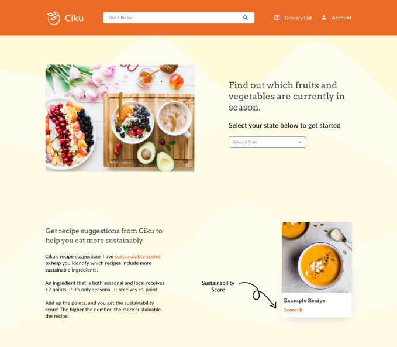

# Ciku

A web app to encourage sustainable eating by helping people find recipes with more seasonal and local produce based on their location (US state) and the current month.

The MVP for this project was developed over 10 weeks by an interdisciplinary team collaborating remotely. The application was originally deployed on AWS EC2 instances running Docker Compose, served at a static IP address. GitHub actions were configured to automatically build and push images to DockerHub on push to the frontend folder. As the project is not actively being developed anymore, and has since been archived, it is also no longer deployed to save on resources. Everything that exists digitally has a real and physical cost.

## Authors

- UX & UI: [@antonetteadiova](https://www.antonetteadiova.com/)
- Backend: [@chriskok](https://github.com/chriskok)
- Frontend: [@kuosandys](https://github.com/kuosandys)

## Installation & Running Locally

To run the full-stack application:

1. Clone this repo:

   `https://github.com/kuosandys/cca-sustainability-app/`

2. From the root directory of the repo, run:

   `docker-compose -f docker-compose-dev.yml up -d`

This runs:

- the backend FastAPI app at port `8000`, with API documentation at `8000/docs`
- the frontend React app at port `80` in development mode with hot reloading for files in `frontend/src/`

For more instructions on installing and running the backend API application, please [see the backend documentation](https://github.com/kuosandys/cca-sustainability-app/tree/main/backend/api).
